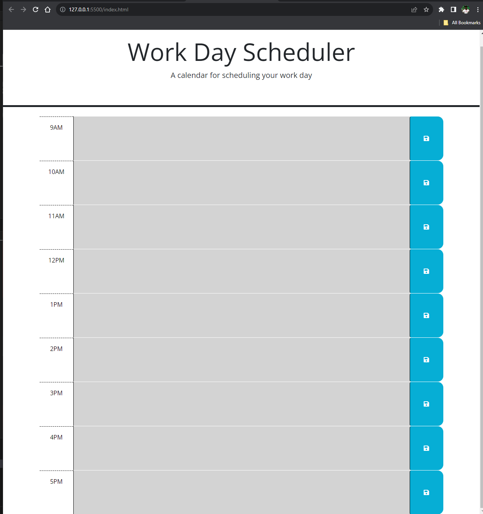
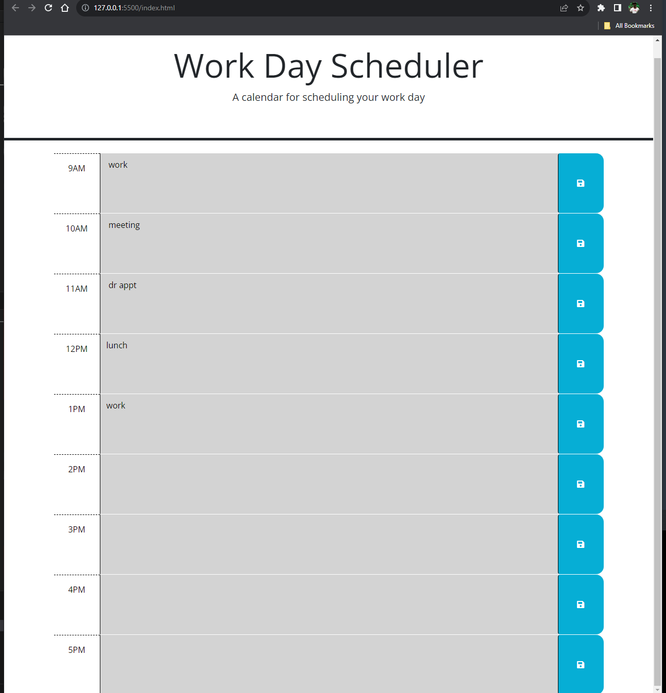

# work-day-scheduler
calendar application that allows users to save events 

## Description

This is a calender that allows you to input events on the time block and once you click the save button it will be stored and will show up the next time you visit page. The only time it will disapear is when you write something different in the time block. 

It syncs up with the current time of my system. So when it is after those hours the time blocks will be gray, when its present time the time block will be red, when the time hasnt happened yet the time block will be green. 

This calender uses HTML, CSS and Javascript. 

## Table of Content 

- [Instalalation](#installation)
- [usage](#usage)
- [Credits](#credits)
- [Liccense](#license) -- https://opensource.org/license/MIT

## Installation 

https://barkleyrhoat.github.io/work-day-scheduler/

## Usage

to access this website you will click the link in github or type in the url address ""

## Credits

https://git.bootcampcontent.com/University-of-Pennsylvania/UPENN-VIRT-FSF-PT-09-2023-U-LOLC

https://www.w3schools.com/jquery/jquery_events.asp

## License

MIT License

Copyright (c) 2023 Barkley

Permission is hereby granted, free of charge, to any person obtaining a copy
of this software and associated documentation files (the "Software"), to deal
in the Software without restriction, including without limitation the rights
to use, copy, modify, merge, publish, distribute, sublicense, and/or sell
copies of the Software, and to permit persons to whom the Software is
furnished to do so, subject to the following conditions:

The above copyright notice and this permission notice shall be included in all
copies or substantial portions of the Software.

THE SOFTWARE IS PROVIDED "AS IS", WITHOUT WARRANTY OF ANY KIND, EXPRESS OR
IMPLIED, INCLUDING BUT NOT LIMITED TO THE WARRANTIES OF MERCHANTABILITY,
FITNESS FOR A PARTICULAR PURPOSE AND NONINFRINGEMENT. IN NO EVENT SHALL THE
AUTHORS OR COPYRIGHT HOLDERS BE LIABLE FOR ANY CLAIM, DAMAGES OR OTHER
LIABILITY, WHETHER IN AN ACTION OF CONTRACT, TORT OR OTHERWISE, ARISING FROM,
OUT OF OR IN CONNECTION WITH THE SOFTWARE OR THE USE OR OTHER DEALINGS IN THE
SOFTWARE.